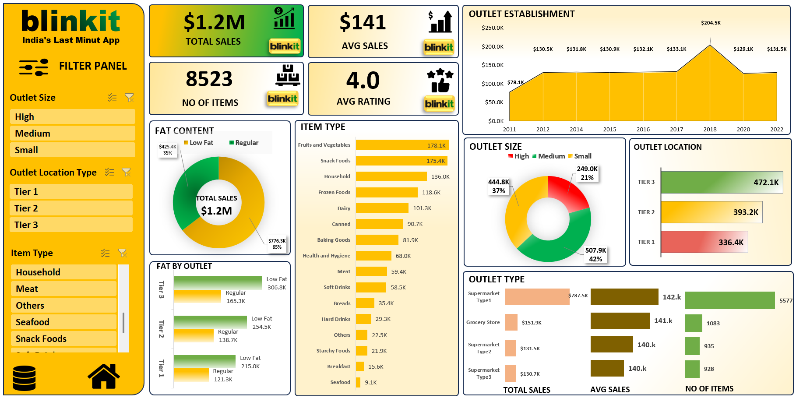

#  Blinkit Sales Dashboard – Excel Data Analytics Project

##  Project Overview
This project analyzes Blinkit grocery sales data using Microsoft Excel to generate business insights on product performance, outlet types, sales distribution, and customer preferences.

An interactive Excel dashboard was developed using Pivot Tables, charts, and slicers to visualize key performance indicators and support data-driven retail decisions.

---

##  Business Problem
Retail platforms like Blinkit handle large volumes of product sales across multiple outlets and locations. Without proper analytics, it becomes difficult to identify:

- Top performing product categories
- Sales performance across outlet types
- Location-based sales distribution
- Impact of item types on revenue
- Outlet size contribution to total sales

This project converts raw retail data into meaningful insights using Excel analytics.

---

##  Tools & Skills Used
- Microsoft Excel
- Pivot Tables
- Pivot Charts
- Interactive Slicers
- Data Cleaning
- KPI Metrics
- Data Visualization

---

##  Dashboard KPIs

Key performance indicators from the dashboard:

- **Total Sales:** $1.2M  
- **Average Sales:** $141  
- **Total Items Sold:** 8523  
- **Average Rating:** 4.0  

---

##  Key Insights

###  Item Category Performance

### Outlet Performance

###  Location Analysis

###  Outlet Size Distribution

### Fat Content Analysis
- Regular fat products generated **65% of total sales**.
- Low-fat products contributed **35% of sales**.

---

##  Dashboard Features
The interactive dashboard includes:

- Outlet Size Filters
- Location Type Filters
- Item Category Filters
- Sales trend by outlet establishment year
- Item type performance analysis
- Outlet type comparison

---

##  Dashboard Preview

---

## Business Impact
This dashboard helps retail managers:

- Identify top-selling product categories
- Analyze outlet performance
- Understand regional sales distribution
- Improve inventory and sales strategies
- Monitor key retail KPIs efficiently
